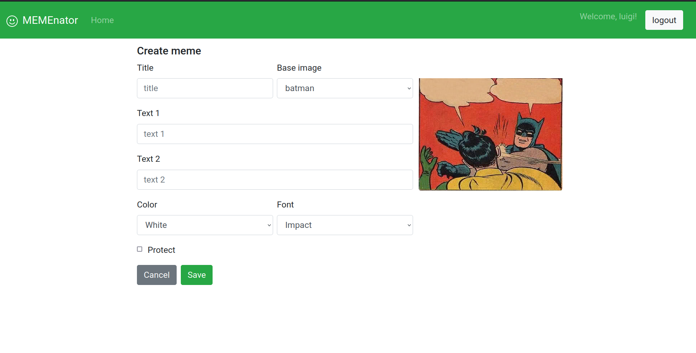

# "MEMEnator"
## React Client Application Routes

- Route `/home`: page that contains the homepage where memes are displayed.
- Route `/create`: page that contains the form for creating a new meme.
- Route `/login`: page that contains a login form.
- Route `/logout`: page that contains a form to log out.

## API Server

- POST `/api/sessions`
  - request body content: 

    - ```json
      {
          "username": "username",
          "password": "password"
      }
      ```

      

  - response body content: 

    - ```json
      {
      	"id": "id",
          "username": "username",
          "password": "password"
      }
      ```

- DELETE `/api/sessions/current`

  - request body content: NONE
  - response body content : NONE

- GET `/api/sessions/current`

  - request body content:  NONE

  - response body content: 

    - ```json
      {
      	"id": "id",
          "username": "username",
          "password": "password"
      }
      ```

  - GET `/api/memes`

  - request body content:  NONE

  - response body content: Array of objects, each describing one meme:

    - ```json
      {
          "id": 5,
          "title": "title",
          "protect": 0,
          "nameCreator": "nameCreator",
          "user": 1,
          "color": "color",
          "font": "font",
          "image": { 
              "id": 7,
              "path": "path" 
          },
          "phrases": [
              {
                  "id": 6,
                  "property": 5,
                  "text": "text",
                  "width": 200,
                  "height": 100,
                  "x": 5,
                  "y": 5
              }
          ]          
      }
      ```

  - GET `/api/memes/public` : 

  - request body content:  NONE

  - response body content: Array of objects, each describing one public meme:

    - ```json
      {
          "id": 5,
          "title": "title",
          "protect": 0,
          "nameCreator": "nameCreator",
          "user": 1,
          "color": "color",
          "font": "font",
          "image": { 
              "id": 7,
              "path": "path" 
          },
          "phrases": [
              {
                  "id": 6,
                  "property": 5,
                  "text": "text",
                  "width": 200,
                  "height": 100,
                  "x": 5,
                  "y": 5
              }
          ]          
      }
      ```

      

- GET`/api/images`

  - request body content:  NONE

  - response body content: Array of objects, each describing one image:

    - ```json
      {
          "id": 5,
          "name": "name",
          "path": "path",
          "phrases": [1,2,6]
      }
      ```

- POST `/api/memes`

  - request body content: object describing new meme

    - ```json
      {
      	"color" : "color",
      	"font": "font",
      	"image": 2,
      	"phrases": [
      		{
      			id: 1,
      			"text": "text"
      		}
      	],
      	"protect": true,
      	"title": "title"
      }
      ```

      

  - response body content: NONE

- DELETE`/api/memes/:id`

  - request body content: NONE

  - request parameters: `ID` of the meme to delete

  - response body content:

    - ```json
      {}
      ```

  - fff

## Database Tables

- Table `user` - contains id name username hash
  - A record identifies a creator user.
- Table `image` - contains id path name
  - A record identifies a basic image for creating a meme 
- Table `meme` - contains id title image protect user font color
  - A record identifies a meme with all its properties
- Table `phrase` - contains id text property meme
  - A record identifies a phrase of a meme and is connected to the specific property and specific meme.
- Table `property_image` - contains id width height x y image
  - A record identifies a property of an image. That is where the texts in the image must be positioned .

## Main React Components

- `Navigation` (in `/components/Navigation.js`): navigational bar that allows you to go back to the home or log in.
- `MemeList` (in `/components/MemeList.js`): component that displays a list of memes and allows you to perform some operations on each of them.
- `MemeForm` (in `/components/MemeForm.js`): component that allows you to create a new meme.
- `Meme` (in `/components/Meme.js`): component that shows the meme with the texts in the right position.
- `MemeModal` (in `/components/MemeModal.js`): component that through a modal shows the meme with all its information.
- `LoginForm` (in `/components/LoginForm.js`): component that takes care of the login.
- `LogoutForm` (in `/components/LogoutForm.js`): component that takes care of the logout.
- `Main` (in `/App.js`): component that contains the logic of the WebApp.

## Screenshot



## Users Credentials

- username: luigi@polito.it  password: luigi, memes: "batman italy vs england", "don't worry", "my dog-2".
- username: antonia@polito.it  password: antonia, memes: "my dog", "valentine", "gamers-2".
- username: marco@polito.it  password: marco, memes: "messi vs ronaldo", "gamers", "don't worry-2".
